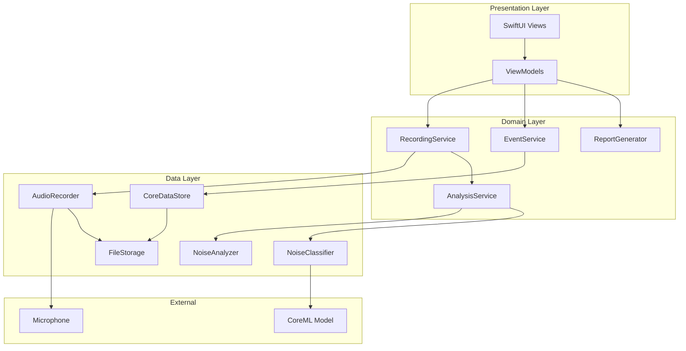

# Design Document: Footstep Noise Analyzer

## Overview

This iOS application captures ambient audio and uses machine learning to detect and classify footstep-related sounds. The app leverages Apple's AVFoundation for audio recording, SoundAnalysis framework combined with a custom Core ML model for footstep classification, and Core Data for persistence. The architecture follows MVVM pattern with clear separation between audio capture, analysis, and presentation layers.

## Architecture



## Components and Interfaces

### AudioRecorder

Handles microphone capture using AVFoundation with background audio support.

```swift
protocol AudioRecorderProtocol {
    var isRecording: Bool { get }
    var currentDuration: TimeInterval { get }
    var audioLevelPublisher: AnyPublisher<Float, Never> { get }
    
    func startRecording() async throws -> RecordingSession
    func stopRecording() async throws -> RecordingSession
    func pauseRecording()
    func resumeRecording()
}

class AudioRecorder: AudioRecorderProtocol {
    private var audioEngine: AVAudioEngine
    private var audioFile: AVAudioFile?
    private var currentSession: RecordingSession?
    
    // Configures AVAudioSession for background recording
    func configureAudioSession() throws {
        let session = AVAudioSession.sharedInstance()
        try session.setCategory(.playAndRecord, mode: .measurement, options: [.allowBluetooth, .defaultToSpeaker])
        try session.setActive(true)
    }
    
    // Installs tap on audio engine for real-time analysis
    func installAudioTap(bufferHandler: @escaping (AVAudioPCMBuffer) -> Void) {
        let inputNode = audioEngine.inputNode
        let format = inputNode.outputFormat(forBus: 0)
        inputNode.installTap(onBus: 0, bufferSize: 4096, format: format) { buffer, time in
            bufferHandler(buffer)
        }
    }
}
```

### NoiseAnalyzer

Processes audio buffers to detect potential footstep events using signal processing.

```swift
protocol NoiseAnalyzerProtocol {
    var detectionPublisher: AnyPublisher<AudioEvent, Never> { get }
    
    func analyze(buffer: AVAudioPCMBuffer, timestamp: TimeInterval)
    func setDetectionThreshold(_ threshold: Float)
}

class NoiseAnalyzer: NoiseAnalyzerProtocol {
    private let detectionSubject = PassthroughSubject<AudioEvent, Never>()
    private var threshold: Float = 0.3
    private var lastEventTime: TimeInterval = 0
    private let minimumEventInterval: TimeInterval = 0.1
    
    // Analyzes audio buffer for transient sounds characteristic of footsteps
    func analyze(buffer: AVAudioPCMBuffer, timestamp: TimeInterval) {
        guard let channelData = buffer.floatChannelData?[0] else { return }
        let frameCount = Int(buffer.frameLength)
        
        // Calculate RMS and peak detection
        let rms = calculateRMS(channelData, frameCount: frameCount)
        let peaks = detectPeaks(channelData, frameCount: frameCount)
        
        // Check for footstep-like transients
        if rms > threshold && timestamp - lastEventTime > minimumEventInterval {
            let event = AudioEvent(
                timestamp: timestamp,
                amplitude: rms,
                buffer: buffer
            )
            detectionSubject.send(event)
            lastEventTime = timestamp
        }
    }
    
    private func calculateRMS(_ data: UnsafeMutablePointer<Float>, frameCount: Int) -> Float {
        var sum: Float = 0
        for i in 0..<frameCount {
            sum += data[i] * data[i]
        }
        return sqrt(sum / Float(frameCount))
    }
}
```

### NoiseClassifier

Uses Core ML model to classify detected sounds into footstep categories.

```swift
protocol NoiseClassifierProtocol {
    func classify(audioBuffer: AVAudioPCMBuffer) async throws -> FootstepClassification
}

struct FootstepClassification {
    let type: FootstepType
    let confidence: Float
    let intensity: IntensityLevel
}

enum FootstepType: String, Codable, CaseIterable {
    case stomping
    case heelStrike = "heel_strike"
    case shuffling
    case running
    case unknown
}

enum IntensityLevel: String, Codable {
    case low
    case medium
    case high
}

class NoiseClassifier: NoiseClassifierProtocol {
    private let soundAnalyzer: SNAudioStreamAnalyzer
    private let classificationRequest: SNClassifySoundRequest
    
    init() throws {
        // Load custom footstep classification model
        let config = MLModelConfiguration()
        config.computeUnits = .cpuAndNeuralEngine
        let model = try FootstepClassifierModel(configuration: config)
        classificationRequest = try SNClassifySoundRequest(mlModel: model.model)
    }
    
    func classify(audioBuffer: AVAudioPCMBuffer) async throws -> FootstepClassification {
        return try await withCheckedThrowingContinuation { continuation in
            let observer = ClassificationObserver { result in
                continuation.resume(returning: result)
            }
            
            do {
                try soundAnalyzer.add(classificationRequest, withObserver: observer)
                soundAnalyzer.analyze(audioBuffer, atAudioFramePosition: 0)
            } catch {
                continuation.resume(throwing: error)
            }
        }
    }
}
```

### AnalysisService

Coordinates real-time audio analysis pipeline.

```swift
protocol AnalysisServiceProtocol {
    var eventPublisher: AnyPublisher<FootstepEvent, Never> { get }
    var isAnalyzing: Bool { get }
    
    func startAnalysis(for session: RecordingSession)
    func stopAnalysis()
}

class AnalysisService: AnalysisServiceProtocol {
    private let noiseAnalyzer: NoiseAnalyzerProtocol
    private let noiseClassifier: NoiseClassifierProtocol
    private let eventSubject = PassthroughSubject<FootstepEvent, Never>()
    private var cancellables = Set<AnyCancellable>()
    
    func startAnalysis(for session: RecordingSession) {
        noiseAnalyzer.detectionPublisher
            .flatMap { [weak self] audioEvent -> AnyPublisher<FootstepEvent, Never> in
                guard let self = self else { return Empty().eraseToAnyPublisher() }
                return Future { promise in
                    Task {
                        do {
                            let classification = try await self.noiseClassifier.classify(audioBuffer: audioEvent.buffer)
                            let footstepEvent = FootstepEvent(
                                id: UUID(),
                                sessionId: session.id,
                                timestamp: audioEvent.timestamp,
                                classification: classification,
                                audioClipURL: nil // Set after saving clip
                            )
                            promise(.success(footstepEvent))
                        } catch {
                            // Log error, don't propagate
                        }
                    }
                }.eraseToAnyPublisher()
            }
            .sink { [weak self] event in
                self?.eventSubject.send(event)
            }
            .store(in: &cancellables)
    }
}
```

### EventService

Manages persistence and retrieval of footstep events.

```swift
protocol EventServiceProtocol {
    func save(event: FootstepEvent) async throws
    func fetchEvents(for sessionId: UUID) async throws -> [FootstepEvent]
    func fetchEvents(from: Date, to: Date) async throws -> [FootstepEvent]
    func deleteEvent(_ event: FootstepEvent) async throws
    func addNote(to eventId: UUID, note: String) async throws
}

class EventService: EventServiceProtocol {
    private let coreDataStore: CoreDataStore
    private let fileStorage: FileStorage
    
    func save(event: FootstepEvent) async throws {
        // Save audio clip to file storage
        if let audioData = event.audioClipData {
            let clipURL = try await fileStorage.saveAudioClip(audioData, eventId: event.id)
            var mutableEvent = event
            mutableEvent.audioClipURL = clipURL
        }
        
        // Persist to Core Data
        try await coreDataStore.save(event)
    }
}
```

### ReportGenerator

Creates evidence reports with statistics and visualizations.

```swift
protocol ReportGeneratorProtocol {
    func generateReport(from: Date, to: Date, includeAudioClips: Bool) async throws -> EvidenceReport
    func exportToPDF(_ report: EvidenceReport) async throws -> URL
}

struct EvidenceReport {
    let dateRange: ClosedRange<Date>
    let totalEvents: Int
    let eventsByType: [FootstepType: Int]
    let eventsByHour: [Int: Int]
    let peakActivityTimes: [Date]
    let events: [FootstepEvent]
    let generatedAt: Date
}

class ReportGenerator: ReportGeneratorProtocol {
    private let eventService: EventServiceProtocol
    
    func generateReport(from: Date, to: Date, includeAudioClips: Bool) async throws -> EvidenceReport {
        let events = try await eventService.fetchEvents(from: from, to: to)
        
        // Calculate statistics
        let eventsByType = Dictionary(grouping: events, by: { $0.classification.type })
            .mapValues { $0.count }
        
        let eventsByHour = Dictionary(grouping: events) { event in
            Calendar.current.component(.hour, from: event.timestamp)
        }.mapValues { $0.count }
        
        let peakHours = eventsByHour.sorted { $0.value > $1.value }.prefix(3).map { $0.key }
        
        return EvidenceReport(
            dateRange: from...to,
            totalEvents: events.count,
            eventsByType: eventsByType,
            eventsByHour: eventsByHour,
            peakActivityTimes: peakHours.map { hour in
                Calendar.current.date(bySettingHour: hour, minute: 0, second: 0, of: from)!
            },
            events: includeAudioClips ? events : events.map { $0.withoutAudioClip() },
            generatedAt: Date()
        )
    }
}
```

## Data Models

### Core Entities

```swift
struct RecordingSession: Identifiable, Codable {
    let id: UUID
    let startTime: Date
    var endTime: Date?
    var duration: TimeInterval { 
        (endTime ?? Date()).timeIntervalSince(startTime) 
    }
    var eventCount: Int
    var fileURLs: [URL]
    var status: SessionStatus
    
    enum SessionStatus: String, Codable {
        case recording
        case paused
        case completed
    }
}

struct FootstepEvent: Identifiable, Codable {
    let id: UUID
    let sessionId: UUID
    let timestamp: Date
    let classification: FootstepClassification
    var audioClipURL: URL?
    var audioClipData: Data?
    var notes: String?
    
    func withoutAudioClip() -> FootstepEvent {
        var copy = self
        copy.audioClipData = nil
        return copy
    }
}

struct FootstepClassification: Codable, Equatable {
    let type: FootstepType
    let confidence: Float
    let intensity: IntensityLevel
}

struct AudioEvent {
    let timestamp: TimeInterval
    let amplitude: Float
    let buffer: AVAudioPCMBuffer
}
```

### Core Data Schema

```swift
// RecordingSessionEntity
@objc(RecordingSessionEntity)
class RecordingSessionEntity: NSManagedObject {
    @NSManaged var id: UUID
    @NSManaged var startTime: Date
    @NSManaged var endTime: Date?
    @NSManaged var eventCount: Int32
    @NSManaged var status: String
    @NSManaged var events: NSSet?
}

// FootstepEventEntity
@objc(FootstepEventEntity)
class FootstepEventEntity: NSManagedObject {
    @NSManaged var id: UUID
    @NSManaged var timestamp: Date
    @NSManaged var classificationType: String
    @NSManaged var confidence: Float
    @NSManaged var intensity: String
    @NSManaged var audioClipPath: String?
    @NSManaged var notes: String?
    @NSManaged var session: RecordingSessionEntity?
}
```

### JSON Serialization

```swift
struct SessionExport: Codable {
    let session: RecordingSession
    let events: [FootstepEvent]
    let exportedAt: Date
    let appVersion: String
}

class JSONSerializer {
    private let encoder: JSONEncoder
    private let decoder: JSONDecoder
    
    init() {
        encoder = JSONEncoder()
        encoder.dateEncodingStrategy = .iso8601
        encoder.outputFormatting = [.prettyPrinted, .sortedKeys]
        
        decoder = JSONDecoder()
        decoder.dateDecodingStrategy = .iso8601
    }
    
    func serialize(_ session: RecordingSession, events: [FootstepEvent]) throws -> Data {
        let export = SessionExport(
            session: session,
            events: events,
            exportedAt: Date(),
            appVersion: Bundle.main.appVersion
        )
        return try encoder.encode(export)
    }
    
    func deserialize(_ data: Data) throws -> SessionExport {
        return try decoder.decode(SessionExport.self, from: data)
    }
}
```


## Correctness Properties

*A property is a characteristic or behavior that should hold true across all valid executions of a system—essentially, a formal statement about what the system should do. Properties serve as the bridge between human-readable specifications and machine-verifiable correctness guarantees.*

### Property 1: Serialization Round-Trip

*For any* valid RecordingSession and associated FootstepEvent objects, serializing to JSON and then deserializing SHALL produce objects equivalent to the originals.

**Validates: Requirements 9.2, 9.3, 9.5**

### Property 2: Classification Output Validity

*For any* audio buffer passed to the NoiseClassifier, the resulting FootstepClassification SHALL have:
- A type that is one of the valid FootstepType enum values
- A confidence score in the range [0.0, 1.0]
- An intensity level that is one of the valid IntensityLevel enum values

**Validates: Requirements 4.1, 4.2, 4.4**

### Property 3: Low Confidence Classification

*For any* classification result where confidence is below 0.5, the classification type SHALL be `.unknown`.

**Validates: Requirements 4.3**

### Property 4: Event Persistence Completeness

*For any* FootstepEvent that is saved, fetching it by ID SHALL return an event with all required fields populated: id, sessionId, timestamp, classification (with type, confidence, intensity), and audioClipURL (if audio was provided).

**Validates: Requirements 5.1, 5.2**

### Property 5: Event Chronological Ordering

*For any* list of FootstepEvents fetched for a session or date range, the events SHALL be sorted in ascending order by timestamp.

**Validates: Requirements 5.3**

### Property 6: Note Persistence

*For any* FootstepEvent, after adding a note string, fetching the event SHALL return the same note string.

**Validates: Requirements 5.4**

### Property 7: Report Statistics Accuracy

*For any* set of FootstepEvents within a date range, the generated EvidenceReport SHALL have:
- totalEvents equal to the count of events
- eventsByType with counts matching the actual distribution of event types
- eventsByHour with counts matching the actual distribution by hour

**Validates: Requirements 6.1**

### Property 8: Session Event Isolation

*For any* RecordingSession, fetching events for that session SHALL return only events with matching sessionId, and no events from other sessions.

**Validates: Requirements 7.2**

### Property 9: Deletion Completeness

*For any* RecordingSession that is deleted, subsequent fetches for that session and its events SHALL return empty results.

**Validates: Requirements 7.3**

### Property 10: Detection Event Validity

*For any* audio buffer that triggers detection (amplitude above threshold), the emitted AudioEvent SHALL have:
- A timestamp greater than or equal to the previous event's timestamp
- A non-nil buffer reference
- An amplitude value greater than the detection threshold

**Validates: Requirements 3.1, 3.2**

### Property 11: Recording State Consistency

*For any* AudioRecorder, after calling startRecording(), isRecording SHALL be true, and after calling stopRecording(), isRecording SHALL be false and a valid RecordingSession SHALL be returned.

**Validates: Requirements 1.1, 1.2**

### Property 12: Duration Monotonicity

*For any* active recording session, the currentDuration value SHALL monotonically increase over time.

**Validates: Requirements 1.3**

### Property 13: Event Count Accuracy

*For any* recording session, the eventCount SHALL equal the number of FootstepEvents associated with that session.

**Validates: Requirements 8.3**

### Property 14: Decibel Calculation Validity

*For any* audio buffer, the calculated decibel level SHALL be a finite number (not NaN or infinity) and SHALL be in a reasonable range for audio levels (e.g., -160 dB to 0 dB for normalized audio).

**Validates: Requirements 8.4**

## Error Handling

### Audio Permission Errors

```swift
enum AudioRecorderError: Error, LocalizedError {
    case microphonePermissionDenied
    case audioSessionConfigurationFailed(underlying: Error)
    case recordingFailed(underlying: Error)
    case fileWriteFailed(underlying: Error)
    
    var errorDescription: String? {
        switch self {
        case .microphonePermissionDenied:
            return "Microphone access is required. Please enable it in Settings > Privacy > Microphone."
        case .audioSessionConfigurationFailed(let error):
            return "Failed to configure audio: \(error.localizedDescription)"
        case .recordingFailed(let error):
            return "Recording failed: \(error.localizedDescription)"
        case .fileWriteFailed(let error):
            return "Failed to save recording: \(error.localizedDescription)"
        }
    }
}
```

### Classification Errors

```swift
enum ClassificationError: Error {
    case modelLoadFailed
    case analysisTimeout
    case invalidAudioFormat
    case insufficientAudioData
}
```

### Persistence Errors

```swift
enum PersistenceError: Error {
    case saveFailed(underlying: Error)
    case fetchFailed(underlying: Error)
    case deleteFailed(underlying: Error)
    case storageFullError
    case corruptedData
}
```

### Error Recovery Strategies

1. **Permission Denied**: Show alert with deep link to Settings app
2. **Recording Failure**: Attempt to save partial recording, notify user
3. **Classification Timeout**: Skip classification, mark event as "unknown"
4. **Storage Full**: Warn user, offer to delete old sessions
5. **Corrupted Data**: Attempt recovery, log error, skip corrupted records

## Testing Strategy

### Dual Testing Approach

This project uses both unit tests and property-based tests for comprehensive coverage:

- **Unit tests**: Verify specific examples, edge cases, and error conditions
- **Property tests**: Verify universal properties across randomly generated inputs

### Property-Based Testing Framework

The project will use [SwiftCheck](https://github.com/typelift/SwiftCheck) for property-based testing in Swift.

**Configuration**:
- Minimum 100 iterations per property test
- Each property test must reference its design document property
- Tag format: `// Feature: footstep-noise-analyzer, Property N: [property description]`

### Test Categories

#### Unit Tests

1. **AudioRecorder Tests**
   - Test permission request handling
   - Test audio session configuration
   - Test file naming and storage paths
   - Test 4-hour file splitting edge case

2. **NoiseAnalyzer Tests**
   - Test RMS calculation with known values
   - Test peak detection algorithm
   - Test threshold adjustment behavior

3. **NoiseClassifier Tests**
   - Test model loading
   - Test classification with sample audio files
   - Test error handling for invalid input

4. **EventService Tests**
   - Test CRUD operations
   - Test filtering by date range
   - Test note addition

5. **ReportGenerator Tests**
   - Test statistics calculation
   - Test PDF export produces valid data

#### Property-Based Tests

Each correctness property from the design document will have a corresponding property-based test:

1. **Serialization Round-Trip** (Property 1)
   - Generate random RecordingSession and FootstepEvent objects
   - Serialize to JSON, deserialize, compare equality

2. **Classification Output Validity** (Property 2)
   - Generate random audio buffers
   - Verify all classification fields are valid

3. **Low Confidence Classification** (Property 3)
   - Generate classifications with confidence < 0.5
   - Verify type is always `.unknown`

4. **Event Persistence** (Properties 4, 5, 6)
   - Generate random events, save, fetch, verify completeness and ordering

5. **Report Statistics** (Property 7)
   - Generate random event sets, generate report, verify statistics match

6. **Session Isolation** (Properties 8, 9)
   - Generate multiple sessions with events, verify isolation and deletion

7. **Detection Validity** (Property 10)
   - Generate audio buffers above threshold, verify event properties

8. **Recording State** (Properties 11, 12)
   - Test state machine transitions

9. **Calculations** (Properties 13, 14)
   - Verify event count accuracy and decibel calculation validity

### Test Data Generators

```swift
extension RecordingSession: Arbitrary {
    public static var arbitrary: Gen<RecordingSession> {
        return Gen<RecordingSession>.compose { c in
            RecordingSession(
                id: c.generate(),
                startTime: c.generate(using: Date.arbitrary),
                endTime: c.generate(using: Date?.arbitrary),
                eventCount: c.generate(using: Int.arbitrary.suchThat { $0 >= 0 }),
                fileURLs: [],
                status: c.generate()
            )
        }
    }
}

extension FootstepEvent: Arbitrary {
    public static var arbitrary: Gen<FootstepEvent> {
        return Gen<FootstepEvent>.compose { c in
            FootstepEvent(
                id: c.generate(),
                sessionId: c.generate(),
                timestamp: c.generate(using: Date.arbitrary),
                classification: c.generate(),
                audioClipURL: nil,
                notes: c.generate(using: String?.arbitrary)
            )
        }
    }
}
```
